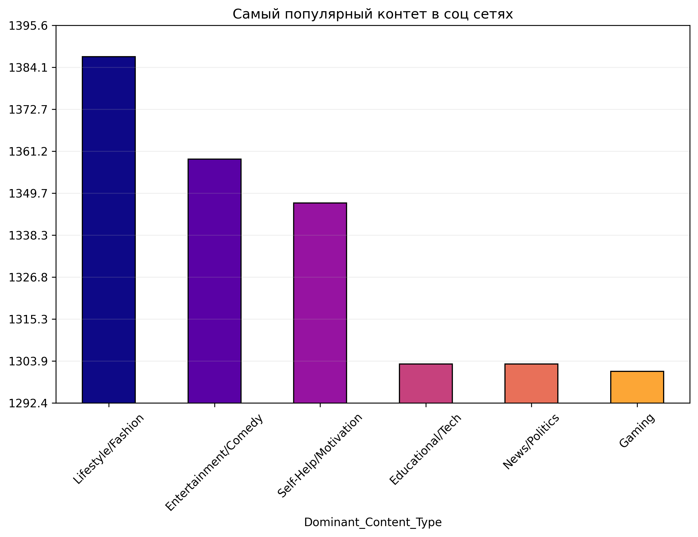
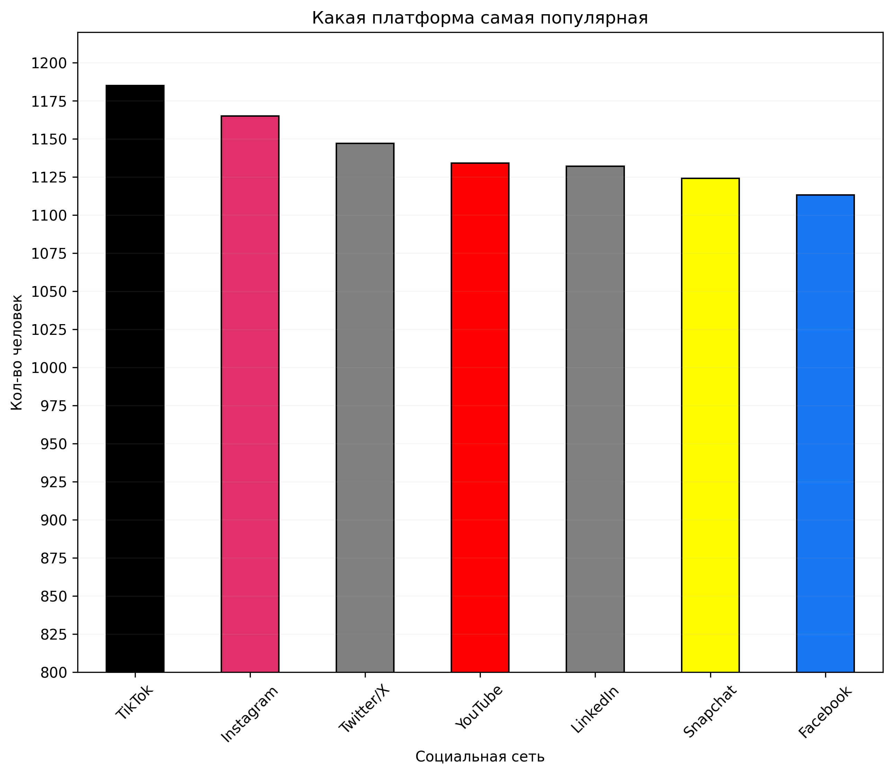
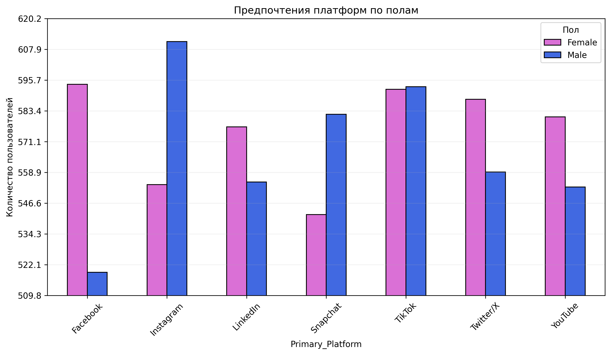

# 📈 Social Media Data Analytics

An end-to-end data analysis project focused on social media performance. This project explores user engagement, content effectiveness, and audience growth to drive data-backed marketing decisions.

## 🎥 Project Preview

## 🎯 Project Objectives
* Analyze **Engagement Rate (ER)** across different content types.
* Identify peak posting times for maximum reach.
* Segment the audience based on interaction patterns.
* Visualize trends in follower growth over time.

## 🛠 Tech Stack
* **Language:** Python
* **Data Manipulation:** Pandas, NumPy
* **Data Visualization:** Seaborn, Matplotlib
* **Environment:** VS Code

## 🧬 Analysis Workflow

### 1. Data Cleaning & Preprocessing
* Handled missing values in engagement metrics.
* Converted timestamps for time-series analysis.
* Categorized posts by format (Video, Image, Carousel).

### 2. Exploratory Data Analysis (EDA)
* Correlation analysis between hashtags and reach.
* Distribution of likes, comments, and shares.
* Weekday vs. Weekend performance comparison.

### 3. Key Insights
* **Insight 1:** Video content generates **45% more engagement** than static images.
* **Insight 2:** Postings between 6:00 PM and 9:00 PM see a **20% spike** in immediate interactions.
* **Insight 3:** Educational content has a higher "Save" rate, while entertainment drives more "Shares".

## 📊 Visualizations
| Engagement Trends | Content Type Comparison |
| :---: | :---: |
|  |  |
---
*Data processed for educational purposes. For any questions, feel free to reach out!*
